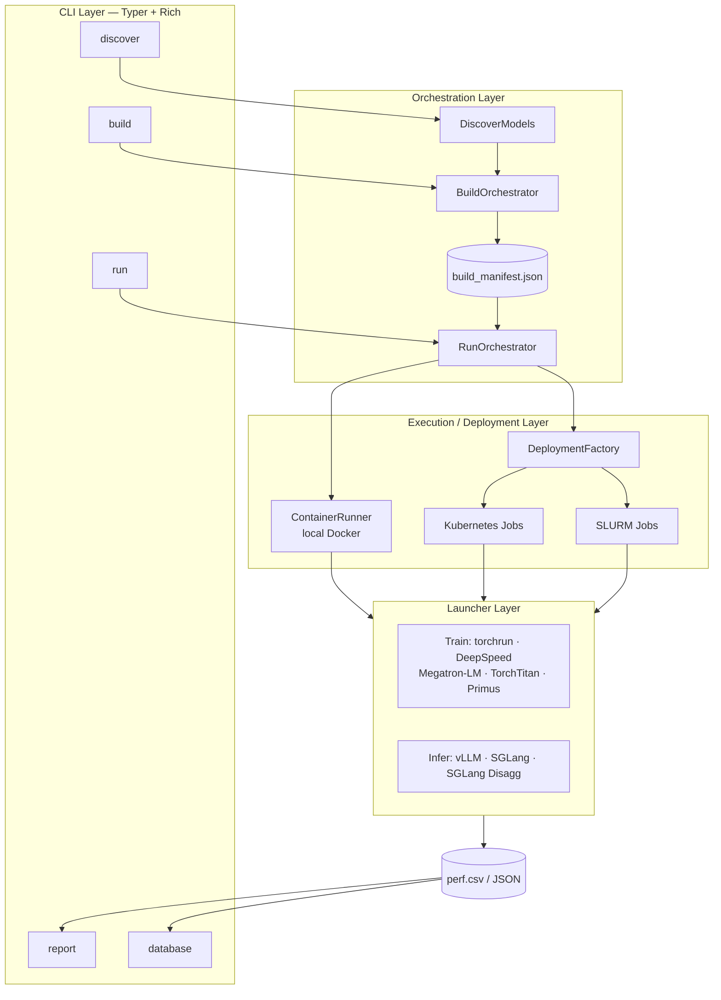
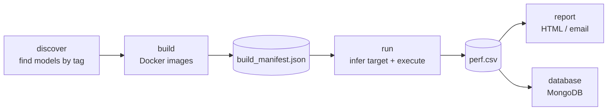
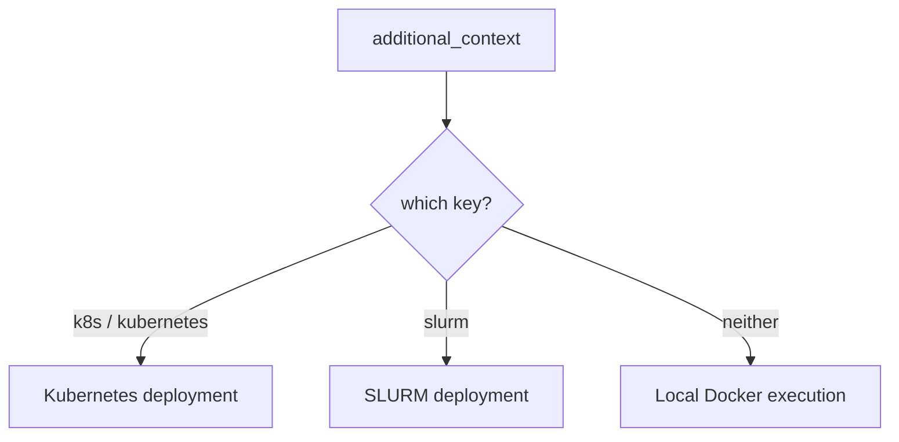

# madengine

<p align="center">
<picture>
  
</picture>
</p>

[](https://python.org)
[](https://github.com/ROCm/madengine/actions)
[](https://github.com/psf/black)
[](CHANGELOG.md)
[](LICENSE)

> **AI model automation and benchmarking platform for local and distributed execution**

madengine is a modern CLI tool for running Large Language Models (LLMs) and Deep Learning models across local and distributed environments. Built for the [MAD (Model Automation and Dashboarding)](https://github.com/ROCm/MAD) ecosystem, it provides seamless execution from single GPUs to multi-node clusters — with the same command working locally, on Kubernetes, and on SLURM.

## ✨ Key Features

- **🚀 Modern CLI** — Rich terminal output with Typer and Rich
- **📝 YAML Config** — Composable [Hydra-based YAML configs](docs/configuration.md#yaml-configuration-config) with config groups, hardware profiles, and CLI overrides — alternative to `--additional-context` JSON
- **🎯 Simple Deployment** — Run locally or deploy to Kubernetes/SLURM by adding a config key; no code changes
- **🔧 Distributed Launchers** — torchrun, DeepSpeed, Megatron-LM, TorchTitan, Primus, vLLM, SGLang
- **🐳 Container-Native** — Docker-based execution with GPU support (ROCm, CUDA)
- **📊 Performance Tools** — Integrated profiling with rocprof/rocprofv3, [rocm-trace-lite](https://github.com/sunway513/rocm-trace-lite), rocBLAS/MIOpen/RCCL tracing → see [Profiling](docs/profiling.md)
- **⚙️ Intelligent Defaults** — Minimal configs auto-merged with presets; host/in-container ROCm path auto-detected → see [Configuration](docs/configuration.md#rocm-path-run-only)

## 🚀 Quick Start

```bash
# Install madengine
pip install git+https://github.com/ROCm/madengine.git

# Clone the MAD package (required for models)
git clone https://github.com/ROCm/MAD.git && cd MAD

# Discover available models
madengine discover --tags dummy

# Run locally (discover → build → run, as configured by the model)
madengine run --tags dummy

# Or with YAML config (Hydra-based, composable)
madengine run --tags dummy --config scheduler=slurm --config launcher=torchrun
madengine run --config my_job.yaml
```

> **Note:** `--config` is mutually exclusive with `--additional-context` / `--additional-context-file`. For build operations `gpu_vendor` defaults to `AMD` and `guest_os` to `UBUNTU`. For non-AMD/Ubuntu environments, set them explicitly, e.g. `--additional-context '{"gpu_vendor": "NVIDIA", "guest_os": "CENTOS"}'`.

**Results:** Performance data is written to `perf.csv` (and optionally `perf_entry.csv`), created automatically if missing. Failed runs are recorded with status `FAILURE` so every attempted model appears. See [Exit Codes](docs/cli-reference.md#exit-codes) for CI usage. If ROCm isn't auto-detected, set `MAD_ROCM_PATH` — see [Configuration](docs/configuration.md#rocm-path-run-only).

## 🏗️ Architecture

madengine is organized in layers: the CLI drives orchestrators that discover and build models, then hand off to a local or distributed execution target, which runs the model under the appropriate launcher and emits performance data for reporting.



1. **CLI Layer** — five commands: `discover`, `build`, `run`, `report`, `database`
2. **Orchestration** — `DiscoverModels` finds models; `BuildOrchestrator` builds images and writes `build_manifest.json`; `RunOrchestrator` reads/triggers the build and infers the target
3. **Execution / Deployment** — local `ContainerRunner`, or `DeploymentFactory` → Kubernetes / SLURM
4. **Launchers** — distributed training and inference frameworks
5. **Output & Post-Processing** — `perf.csv`/JSON results → `report` (HTML/email) and `database` (MongoDB)

## 🔄 Workflow

The core pipeline is the same everywhere: discover models, build images once, run them against a target, then report. Build and run can be separated so images are built once (e.g. in CI) and reused across nodes.



**Deployment target is inferred from the config** (Convention over Configuration) — no `deploy` flag needed:



## 📋 Commands

| Command | Description | Use Case |
|---------|-------------|----------|
| **[discover](docs/usage.md#model-discovery)** | Find available models | Model exploration and validation |
| **[build](docs/usage.md#build-workflow)** | Build Docker images | Create containerized models |
| **[run](docs/usage.md#run-workflow)** | Execute models | Local and distributed execution |
| **[report](docs/cli-reference.md#report---generate-reports)** | Generate HTML/email reports | Convert CSV to viewable reports |
| **[database](docs/cli-reference.md#database---upload-to-mongodb)** | Upload to MongoDB | Store results in a database |

```bash
madengine discover --tags dummy          # Find models
madengine build --tags dummy             # Build image (AMD/UBUNTU defaults)
madengine run --tags dummy               # Run model
madengine report to-html --csv-file-path perf_entry.csv          # Report
madengine database --file perf_entry.csv --db mydb --collection results  # Upload
```

For all options and examples, see the **[CLI Reference](docs/cli-reference.md)**.

## 💻 Usage Examples

```bash
# Local, multi-GPU with torchrun (DDP/FSDP)
madengine run --tags model \
  --additional-context '{"docker_gpus": "0,1,2,3",
    "distributed": {"launcher": "torchrun", "nproc_per_node": 4}}'

# Kubernetes (minimal config, presets auto-applied)
madengine run --tags model \
  --additional-context '{"k8s": {"gpu_count": 2}}'

# SLURM (build once, then deploy)
madengine build --tags model --registry gcr.io/myproject
madengine run --manifest-file build_manifest.json \
  --additional-context '{"slurm": {"partition": "gpu", "nodes": 4, "gpus_per_node": 8},
    "distributed": {"launcher": "torchtitan", "nnodes": 4, "nproc_per_node": 8}}'
```

More local/K8s/SLURM/CI recipes: [Usage Guide](docs/usage.md) · [Configuration](docs/configuration.md) · [CLI Reference](docs/cli-reference.md).

## 📚 Documentation

| Guide | Description |
|-------|-------------|
| [Installation](docs/installation.md) | Complete installation instructions |
| [Usage Guide](docs/usage.md) | Commands, workflows, and examples |
| **[CLI Reference](docs/cli-reference.md)** | **Detailed command options and examples** |
| [Configuration](docs/configuration.md) | Advanced options; [YAML config (`--config`)](docs/configuration.md#yaml-configuration-config); ROCm path; log error scan |
| [Deployment](docs/deployment.md) | Kubernetes and SLURM deployment |
| [Batch Build](docs/batch-build.md) | Selective builds for CI/CD |
| [Launchers](docs/launchers.md) | Distributed frameworks + capability matrices |
| [Profiling](docs/profiling.md) | Performance analysis tools |
| [Contributing](docs/contributing.md) | How to contribute |

## 🎯 Supported Launchers

| Launcher | Local | Kubernetes | SLURM | Type | Key Features |
|----------|-------|-----------|-------|------|--------------|
| **torchrun** | ✅ | ✅ | ✅ | Training | PyTorch DDP/FSDP, elastic training |
| **DeepSpeed** | ✅ | ✅ | ✅ | Training | ZeRO optimization, pipeline parallelism |
| **Megatron-LM** | ✅ | ✅ | ✅ | Training | Tensor+Pipeline parallel, large transformers |
| **TorchTitan** | ✅ | ✅ | ✅ | Training | FSDP2+TP+PP+CP, Llama 3.1 (8B–405B) |
| **Primus** | ✅ | ✅ | ✅ | Training | Megatron / TorchTitan / MaxText via Primus YAML |
| **vLLM** | ✅ | ✅ | ✅ | Inference | v1 engine, PagedAttention, Ray cluster |
| **SGLang** | ✅ | ✅ | ✅ | Inference | RadixAttention, structured generation |
| **SGLang Disagg** | ❌ | ✅ | ✅ | Inference | Disaggregated prefill/decode, Mooncake, 3+ nodes |

All launchers support single-GPU, multi-GPU, and multi-node (where infrastructure allows). See the [Launchers Guide](docs/launchers.md) for the full **parallelism** and **infrastructure** capability matrices.

## 📊 Profiling

madengine ships integrated profiling for AMD ROCm — `rocprof`, eight pre-configured `rocprofv3` profiles (ROCm 7.0+), `rocm-trace-lite`, library tracing (rocBLAS/MIOpen/Tensile/RCCL), and power/VRAM monitors. Tools are stackable via `--additional-context '{"tools": [...]}'`.

```bash
madengine run --tags model --additional-context '{"tools": [{"name": "rocprofv3_compute"}]}'
```

See the [Profiling Guide](docs/profiling.md) and ready-to-use configs in [`examples/profiling-configs/`](examples/profiling-configs/).

## 📦 Installation

```bash
# Install (all dependencies, including Kubernetes support, included)
pip install git+https://github.com/ROCm/madengine.git

# Development installation
git clone https://github.com/ROCm/madengine.git
cd madengine && pip install -e .
```

See the [Installation Guide](docs/installation.md) for details.

## 📝 YAML Configuration (`--config`)

The `--config` flag is a YAML spelling of the same `additional_context` dict as `--additional-context`. It is available on both `run` and `build`.

> **Note**: `--config` is **mutually exclusive** with `--additional-context` and `--additional-context-file`. Using them together produces an error. Job YAML uses JSON-shaped keys (`slurm`, `distributed`, `env_vars`); it is not a Hydra `defaults:` list.

### Basic Usage

```bash
# Use a config group override
madengine run --tags dummy --config scheduler=slurm

# Combine multiple overrides
madengine run --tags dummy \
  --config scheduler=slurm \
  --config launcher=torchrun \
  --config distributed.nnodes=4

# Use a user YAML file
madengine run --config my_job.yaml

# User YAML file with overrides
madengine run --config my_job.yaml --config distributed.nnodes=8

# Append optional config groups with '+' prefix
madengine run --tags dummy \
  --config +profile=mi300x_8gpu \
  --config +env=nccl_debug \
  --config +tools=rocprofv3_lightweight
```

### Config Groups

madengine ships with pre-built config groups that compose together:

| Group | Default | Options | Description |
|-------|---------|---------|-------------|
| `platform` | `docker` | docker (only supported) | Execution platform |
| `scheduler` | `local` | local, slurm, k8s | Job scheduler (adds root `slurm:` / `k8s:` like JSON) |
| `hardware` | `amd` | amd, nvidia, cpu | Sets `gpu_vendor` / `guest_os` |
| `launcher` | `none` | none, torchrun, deepspeed, megatron / megatron-lm, torchtitan, vllm, sglang, sglang_disagg, primus, native, slurm_multi | Distributed launcher |
| `+profile` | *(none)* | mi300x_8gpu, mi300x_single, mi250x_4gpu, h100_8gpu, a100_8gpu | Hardware profiles (append-only) |
| `+env` | *(none)* | nccl_debug, nccl_tuned, infiniband, miopen_defaults | Environment presets (append-only) |
| `+tools` | *(none)* | rocprofv3_lightweight, rocprofv3_comprehensive, power_profiler, vram_profiler, rocm_trace_lite | Profiling tools (append-only) |
| `+data` | *(none)* | local, s3, minio, nas | Data source config (append-only) |
| `+build` | *(none)* | default, ci, multi_arch | `ci` = `--clean-docker-cache`; `multi_arch` = `--target-archs gfx90a gfx942` |

Groups with `+` prefix are append-only — they are not loaded by default and must be explicitly added.

### User YAML Files

Create a YAML file for your job and pass it via `--config`:

```yaml
# my_job.yaml
model:
  tags: [dummy]
  timeout: 3600

debug: true

env_vars:
  MY_VAR: test_value
  NCCL_DEBUG: INFO

distributed:
  enabled: true
  launcher: torchrun
  nnodes: 2
  nproc_per_node: 4

slurm:
  partition: gpu
  time: "02:00:00"
```

```bash
madengine run --config my_job.yaml
```

User YAML is merged over the base config groups. Additional `--config key=value` overrides are applied last and win over the YAML file.

### Examples

```bash
# SLURM multi-node with torchrun
madengine run --tags model \
  --config scheduler=slurm \
  --config launcher=torchrun \
  --config distributed.nnodes=4

# MI300x 8-GPU profile with NCCL debug
madengine run --tags model \
  --config +profile=mi300x_8gpu \
  --config +env=nccl_debug

# NVIDIA hardware with profiling
madengine run --tags model \
  --config hardware=nvidia \
  --config +tools=rocprofv3_lightweight

# Build with CI preset
madengine build --tags model \
  --config +build=ci \
  --registry docker.io/myorg
```

See [Configuration Guide](docs/configuration.md#yaml-configuration-config) for full details, and [`examples/configs/`](examples/configs/) for annotated templates and ready-to-run demo files.

## 💡 Tips & Troubleshooting

- **Test locally first** with a single GPU before scaling to multi-node; use config files for complex setups.
- **Debugging:** add `--verbose --live-output`; keep a container for inspection with `--keep-alive`.
- **CI:** the CLI uses fixed [exit codes](docs/cli-reference.md#exit-codes) (`0` success, `2` build failure, `3` run failure, `4` invalid args) — no log scraping needed.
- **Log error scan** can flag benign `RuntimeError:` text; disable or tune it via `log_error_pattern_scan` / `log_error_benign_patterns` — see [Configuration](docs/configuration.md#run-phase-log-error-pattern-scan).

More: [Usage — Troubleshooting](docs/usage.md#troubleshooting) · [Profiling — False failures](docs/profiling.md#false-failure-detection-with-rocprof).

## 🤝 Contributing

Contributions are welcome! See the [Contributing Guide](docs/contributing.md).

```bash
git clone https://github.com/ROCm/madengine.git
cd madengine && python3 -m venv venv && source venv/bin/activate
pip install -e .
pytest
```

## 📄 License

MIT License — see [LICENSE](LICENSE).

## 🔗 Links & Resources

- **MAD Package:** https://github.com/ROCm/MAD
- **Issues & Support:** https://github.com/ROCm/madengine/issues
- **ROCm Documentation:** https://rocm.docs.amd.com/
- **Command help:** `madengine --help` · `madengine <command> --help`

---

## ⚠️ Migration Notice (v2.0.0+)

The CLI has been unified. Starting from v2.0.0, use `madengine` (with K8s, SLURM, and distributed support); the legacy v1.x CLI has been removed.
