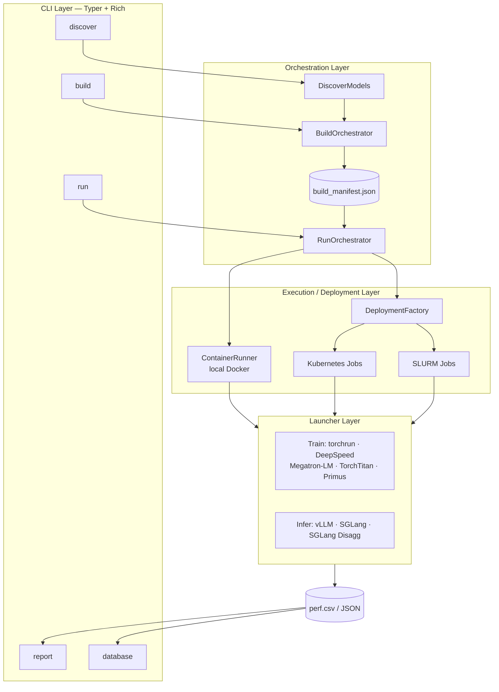

# madengine Documentation

Complete documentation for madengine - AI model automation and distributed benchmarking platform.

## 📚 Documentation Index

### Getting Started

| Guide | Description |
|-------|-------------|
| [Installation](installation.md) | Complete installation instructions |
| [Usage Guide](usage.md) | Commands, configuration, and examples ([`--skip-model-run`](usage.md#skip-model-run-after-build)) |

### Configuration & Deployment

| Guide | Description |
|-------|-------------|
| [Configuration](configuration.md) | Advanced configuration options (includes [run log error pattern scan](configuration.md#run-phase-log-error-pattern-scan)) |
| [Batch Build](batch-build.md) | Selective builds with batch manifests |
| [Deployment](deployment.md) | Kubernetes and SLURM deployment |
| [llm-d](llm-d.md) | Benchmarking the llm-d distributed inference stack |
| [Launchers](launchers.md) | Multi-node training frameworks |

### Advanced Topics

| Guide | Description |
|-------|-------------|
| [Profiling](profiling.md) | Performance analysis tools |
| [Contributing](contributing.md) | How to contribute to madengine |

### Reference

| Guide | Description |
|-------|-------------|
| **[CLI Reference](cli-reference.md)** | **Complete command-line options and examples** |

## 🏗️ Architecture

The CLI drives orchestrators that discover and build models, then hand off to a local or distributed execution target, which runs the model under the appropriate launcher and emits performance data for reporting. (Same diagram as the [main README](../README.md#-architecture).)

1. **CLI Layer** - User interface with 5 commands (discover, build, run, report, database)
2. **Model Discovery** - Find and validate models from MAD package
3. **Orchestration** - BuildOrchestrator & RunOrchestrator manage workflows
4. **Execution Targets** - Local Docker, Kubernetes Jobs, or SLURM Jobs
5. **Distributed Launchers** - Training (torchrun, DeepSpeed, Megatron-LM, TorchTitan, Primus) and Inference (vLLM, SGLang)
6. **Performance Output** - CSV/JSON results with metrics
7. **Post-Processing** - Report generation (HTML/Email) and database upload (MongoDB)

## 🚀 Quick Links

- **Main Repository**: https://github.com/ROCm/madengine
- **MAD Package**: https://github.com/ROCm/MAD
- **Issues**: https://github.com/ROCm/madengine/issues
- **ROCm Documentation**: https://rocm.docs.amd.com/

## 📖 Documentation by Use Case

### I want to...

**Run a model locally**
→ [Installation](installation.md) → [Usage Guide](usage.md)

**Deploy to Kubernetes**
→ [Configuration](configuration.md) → [Deployment](deployment.md)

**Deploy to SLURM**
→ [Configuration](configuration.md) → [Deployment](deployment.md)

**Build multiple models selectively (CI/CD)**
→ [Batch Build](batch-build.md)

**Profile model performance**
→ [Profiling](profiling.md)

**Multi-node distributed training**
→ [Launchers](launchers.md) → [Deployment](deployment.md)

**Contribute to madengine**
→ [Contributing](contributing.md)

## 🔍 Key Concepts

### MAD Package

madengine operates within the MAD (Model Automation and Dashboarding) ecosystem. The MAD package contains:
- Model definitions (`models.json`)
- Execution scripts (`run.sh`)
- Docker configurations
- Data provider configurations (`data.json`)
- Credentials (`credential.json`)

### CLI Interface

**`madengine`** - Modern CLI with:
- Rich terminal output
- Distributed deployment support (K8s, SLURM)
- Build/run separation
- Manifest-based execution

### Deployment Targets

- **Local** - Docker containers on local machine
- **Kubernetes** - Cloud-native container orchestration
- **SLURM** - HPC cluster job scheduling

### Distributed Launchers

- **torchrun** - PyTorch DDP/FSDP
- **deepspeed** - ZeRO optimization
- **megatron-lm** - Large transformers (K8s + SLURM)
- **torchtitan** - LLM pre-training
- **vllm** - LLM inference
- **sglang** - Structured generation

## 📝 Documentation Standards

This documentation follows these principles:

1. **Task-oriented** - Organized by what users want to accomplish
2. **Progressive disclosure** - Start simple, add complexity as needed
3. **Examples first** - Show working examples before explaining details
4. **Consistent naming** - Files follow simple naming pattern (no prefixes)
5. **Up-to-date** - Tracks the current implementation; see [CHANGELOG.md](../CHANGELOG.md) for release history

## 🤝 Contributing to Documentation

Documentation improvements are welcome! Please:

1. Keep examples working and tested
2. Use consistent formatting and style
3. Update cross-references when moving content
4. Mark deprecated content clearly
5. Follow the existing structure

See [Contributing Guide](contributing.md) for details.

## 📄 License

madengine is licensed under the MIT License. See [LICENSE](../LICENSE) for details.
