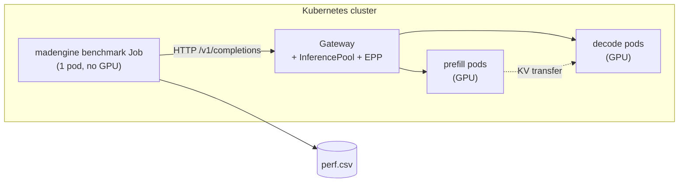

# llm-d Deployment Guide

Benchmark [llm-d](https://github.com/llm-d/llm-d) — a Kubernetes-native distributed
inference stack — from madengine.

## Overview

llm-d serves a model with vLLM/SGLang model servers behind a Gateway API Inference
Extension: an `InferencePool` plus an Endpoint Picker (EPP) that routes requests with
awareness of prefix cache and prefill/decode disaggregation.

madengine's job here is **benchmarking**, not serving. The benchmark client is an
ordinary single-pod, CPU-only Kubernetes Job — the same Job machinery as the `k8s`
target, with the llm-d endpoint injected into its environment. The GPUs belong to the
llm-d model servers, not to the client.



## Two modes

| | **attach** | **managed** |
|---|---|---|
| Trigger | `llm_d.endpoint_url` is set | `llm_d.endpoint_url` is null |
| Who stands the stack up | you | madengine, via `helm` |
| Needs `helm` on PATH | no | yes |
| Tears the stack down | **never** | yes, unless `teardown: false` |

Attach mode is the safe default for a shared cluster: madengine cannot install or
delete anything belonging to a stack it did not create.

## Prerequisites

Both modes:

- Kubeconfig configured (`~/.kube/config` or in-cluster)
- **The target namespace must already exist.** madengine never creates or deletes a
  namespace.

Managed mode additionally:

- A Kubernetes cluster with a GPU device plugin
  ([AMD](https://github.com/ROCm/k8s-device-plugin) / [NVIDIA](https://github.com/NVIDIA/k8s-device-plugin)).
  Attach mode has no GPU-node requirement of its own: the GPUs belong to a stack
  madengine did not install, possibly not even in this cluster; only cluster
  connectivity and the namespace are checked.
- `helm` on `PATH`
- Gateway API and Gateway API Inference Extension CRDs, plus a gateway controller
  watching your `gatewayClassName`. These are cluster-admin installs; madengine
  detects them and prints an install hint, but does not install them:

  ```bash
  kubectl apply -f https://github.com/kubernetes-sigs/gateway-api/releases/latest/download/standard-install.yaml
  ```

- Pinned chart versions (see [Chart versions](#chart-versions))
- If the model is gated, a Secret holding the HF token that already exists in the
  namespace. Pass its **name** as `llm_d.model.hf_token_secret`; the token itself never
  reaches a values file or a helm command line.

## Quick start — attach mode

Point madengine at a gateway you already have:

```bash
madengine run --tags my_llm_d_benchmark --additional-context '{
  "k8s": {"namespace": "llm-d-bench", "gpu_count": 0},
  "llm_d": {
    "endpoint_url": "http://llm-d-inference-gateway.llm-d-bench.svc.cluster.local:80",
    "model": {"name": "Qwen3-32B"}
  }
}'
```

`model.name` is required in both modes: it is the model string sent in inference
requests and the value recorded in `perf.csv`.

The examples on this page use `Qwen/Qwen3-32B`, `deepseek-ai/DeepSeek-R1-0528` and
`meta-llama/Llama-3.1-8B-Instruct` — repos MAD already tracks for standalone vLLM
benchmarking (`scripts/vllm/models.json`). llm-d benchmarks the same repos, served
through an external gateway instead of inside the benchmark container.

## Quick start — managed mode

```bash
madengine run --tags my_llm_d_benchmark --additional-context '{
  "k8s": {"namespace": "llm-d-bench", "gpu_count": 0},
  "llm_d": {
    "model": {"hf_repo": "Qwen/Qwen3-32B", "name": "Qwen3-32B", "hf_token_secret": "hf-token"},
    "gateway": "agentgateway",
    "prefill": {"replicas": 2, "tensor_parallel": 8, "gpu_count": 8},
    "decode":  {"replicas": 1, "tensor_parallel": 8, "gpu_count": 8},
    "charts": {
      "infra":        {"version": "<pin>"},
      "gaie":         {"version": "<pin>"},
      "modelservice": {"version": "<pin>"}
    }
  }
}'
```

What happens:

1. `validate()` checks cluster access, GPU nodes, `helm`, pinned chart versions and CRDs.
2. `prepare()` ensures the `madengine-shared-data` PVC exists if `model.uri` names it,
   populates it with `model.hf_repo` if `model.cache_pvc` is set (see
   [Model weights: `hf_repo` vs `uri`](#model-weights-hf_repo-vs-uri)), installs three helm
   releases in order — `*-infra`, `*-gaie`, `*-modelservice` — then waits for the
   model-server Deployments and reads the gateway address off the live `Gateway` resource.
3. The benchmark client Job is rendered with that endpoint and submitted.
4. On the way out — **success or failure** — the three releases are uninstalled.

## Which container serves the model

`prefill.image`/`decode.image` default to the **same image the `--tags`-selected model
builds** for every other target — `madengine run --tags <model>` determines what serves
the model here exactly as it does for `k8s`, not just what benchmarks it. Point `--tags`
at a model whose Dockerfile is itself a serving container (vLLM/SGLang baked in and
tuned, `pyt_vllm_*`-style in `scripts/vllm/models.json`), and that image — pinned to a
digest when `require_pinned_image` is set, same as every other target — is what the
prefill/decode pods run. `model.uri`/`hf_repo` still tell that image which weights to
load; the Dockerfile supplies the serving stack, not the weights.

Set `prefill.image`/`decode.image` explicitly to override this, e.g. to benchmark an
upstream vLLM image unrelated to any madengine model build.

If you leave them defaulted, `validate()` prints a warning naming the image the
prefill/decode pods will run. From madengine's side a real serving image and a
client-only image are indistinguishable, so it says so rather than guessing.

## Model weights: `hf_repo` vs `uri`

`model.uri` is the literal artifact URI the modelservice chart reads. `model.hf_repo` is
shorthand for the common case: set it to an HF repo id and madengine builds
`hf://<hf_repo>` itself. Either way, plain `hf://` downloads the model fresh on **every**
standup — the chart's `hf://` scheme has no caching of its own.

The chart's `pvc://`/`pvc+hf://` schemes look like a caching mechanism but are not one:
they only **mount** an already-populated PVC by claim name — they contain no download
logic. Set `model.cache_pvc` to a PVC name alongside `hf_repo` to get real caching:
madengine downloads the repo onto that PVC itself, in a one-off Job it runs before
`helm install` (bounded by `model.cache_timeout`, default `7200` seconds), then points the
chart at `pvc+hf://<cache_pvc>/hf_hub_cache/<hf_repo>`. Re-runs against the same PVC are
fast — the download Job still starts, but `huggingface_hub.snapshot_download`'s own
per-file check means it re-verifies rather than re-downloads. If `cache_pvc` is
`madengine-shared-data`, madengine creates the PVC itself (the same PVC the `k8s` target
already manages for datasets; see `k8s_pvc.py`) so there is something to populate;
anything else must already exist. `model.cache_job_image` overrides the download Job's
image (default `python:3.11-slim`); `model.hf_token_secret` is reused for the download
Job's own `HF_TOKEN` env var (same Secret and key, `HF_TOKEN`, the chart itself reads).

An explicit `model.uri` always wins over `hf_repo`/`cache_pvc`, so a raw `hf://` or
`pvc://` URI still works unchanged — set it directly if you'd rather pre-populate a PVC
out-of-band (see llm-d-modelservice's own `examples/pvc/README.md`) instead of using
madengine's own download Job.

### Always dry-run first

`helm template` the whole stack and inspect it before spending cluster GPUs:

```bash
madengine run --tags my_llm_d_benchmark --additional-context '{
  "k8s": {"namespace": "llm-d-bench", "output_dir": "./k8s_manifests"},
  "llm_d": {"dry_run": true, "model": {...}, "charts": {...}}
}'
```

This writes `llm-d-<component>-values.yaml` and `llm-d-<component>-manifests.yaml` to
`k8s.output_dir`, installs nothing, and submits no Job. It is the way to check the
generated values against the chart versions you pinned.

A dry run deliberately runs none of `validate()`'s cluster checks — the point is to work
before the cluster is ready. It needs only a loadable kubeconfig, `helm` on `PATH`, and
chart versions it can pull. Unpinned versions are still refused.

A managed run that is *not* a dry run writes the same `llm-d-<component>-values.yaml`
files to `k8s.output_dir` before installing, so you can always see exactly what was
handed to helm.

## The benchmark contract

madengine injects these into the client pod; your model's `run.sh` reads them:

| Variable | Meaning |
|---|---|
| `MAD_LLM_D_ENDPOINT` | Base URL of the gateway (OpenAI-compatible) |
| `MAD_LLM_D_MODEL` | Model name to send in requests |
| `MAD_LLM_D_NAMESPACE` | Namespace the stack runs in |
| `MAD_LLM_D_PREFILL_REPLICAS` | Prefill replicas (0 = aggregated serving) |
| `MAD_LLM_D_DECODE_REPLICAS` | Decode replicas |
| `MAD_LLM_D_TP` | Decode tensor-parallel size |
| `MAD_LLM_D_RELEASE_PREFIX` | Helm release prefix — the releases are `<prefix>-infra`, `<prefix>-gaie`, `<prefix>-modelservice`. **Managed mode only**; attach mode sets no releases and so does not set it |

The script drives load however it likes — `vllm bench serve`, `guidellm`,
`inference-perf`, or plain HTTP — and emits results the way every other madengine model
does:

```
performance: 1234.5 tokens_per_second
```

or a `multiple_results` CSV. No reporting code is llm-d-specific.

A minimal client:

```bash
#!/bin/bash
set -euo pipefail
: "${MAD_LLM_D_ENDPOINT:?not set}"
: "${MAD_LLM_D_MODEL:?not set}"

vllm bench serve \
  --base-url "$MAD_LLM_D_ENDPOINT" \
  --model "$MAD_LLM_D_MODEL" \
  --num-prompts 200 | tee bench.log

throughput=$(grep -oP 'Output token throughput.*?\K[0-9.]+' bench.log)
echo "performance: ${throughput} tokens_per_second"
```

The client image needs no GPU and no ROCm — a `python:3.11-slim` base is enough — in
attach mode, and in managed mode whenever `prefill.image`/`decode.image` are set
explicitly. Left defaulted in managed mode, that same image also *serves* the model and
must be a serving container: see
[Which container serves the model](#which-container-serves-the-model). For the
same reason the llm-d preset sets `generate_sys_env_details: false`: collecting ROCm
environment details in a pod with no GPU would only record an empty environment. Set it
back to `true` if you want it anyway.

## Configuration reference

Every key below lives under `llm_d`. Defaults come from
`src/madengine/deployment/presets/llm-d/defaults.json` and are deep-merged under your
config, so you only specify what differs.

| Key | Default | Meaning |
|---|---|---|
| `endpoint_url` | `null` | Set → attach mode |
| `dry_run` | `false` | Render values + `helm template`, install nothing |
| `release_prefix` | `"madengine"` | Prefix for the three helm release names |
| `gateway` | `"agentgateway"` | `gatewayClassName` and GAIE provider |
| `model.uri` | `null` | Artifact the servers load, e.g. `hf://Qwen/Qwen3-32B`. Required in managed mode unless `hf_repo` is set |
| `model.hf_repo` | `null` | Simpler alternative to `uri`: an HF repo id, e.g. `Qwen/Qwen3-32B`. Resolves to `hf://<hf_repo>` (re-downloaded every run), or to `pvc+hf://<cache_pvc>/hf_hub_cache/<hf_repo>` if `cache_pvc` is also set. Ignored if `uri` is set |
| `model.cache_pvc` | `null` | PVC to cache `hf_repo` onto. madengine downloads it there once, in a Job run before standup, instead of re-downloading every run |
| `model.cache_timeout` | `7200` | Bounds the cache-population Job, seconds |
| `model.cache_job_image` | `null` | Image for the cache-population Job. Defaults to `python:3.11-slim` |
| `model.name` | `null` | Model name in requests and `perf.csv`. **Required in both modes** |
| `model.hf_token_secret` | `null` | Name of an existing Secret holding the HF token (key `HF_TOKEN`). Also used by the cache-population Job |
| `model.size` | `null` | Size of the model-artifact volume |
| `prefill.replicas` | `1` | `0` disables the prefill role (aggregated serving) |
| `prefill.tensor_parallel` | `1` | `--tensor-parallel-size` |
| `prefill.gpu_count` | `1` | GPUs per prefill pod |
| `prefill.image` | the `--tags`-selected model's own built image | Override the model-server image |
| `decode.*` | same shape | Decode role |
| `charts.<c>.ref` | OCI refs | Chart location; override for an air-gapped mirror |
| `charts.<c>.version` | `null` | **Must be pinned** in managed mode |
| `standup_timeout` | `1800` | Per-release `helm --wait` timeout, seconds |
| `readiness_timeout` | `1800` | Model-server readiness poll timeout, seconds |
| `teardown` | `true` | `false` leaves releases running for debugging |
| `extra_values` | `{}` | Escape hatch, deep-merged into chart values last |

The GPU resource name (`amd.com/gpu` vs `nvidia.com/gpu`) comes from
`k8s.gpu_resource_name`, shared with the ordinary Kubernetes target.

One `k8s` key behaves differently under llm-d: **`k8s.gpu_count` defaults to `0`**, not
`1`. The GPUs belong to the llm-d model servers; the benchmark client is a CPU-only load
generator, and a client Job that reserves a GPU it never uses competes with the very
stack it is measuring. Setting `k8s.gpu_count` yourself still wins, as do the usual
runtime GPU overrides.

### Chart versions

Chart versions ship as `null` and managed mode **refuses to run** until you pin them.
This is deliberate: floating chart versions make benchmark numbers non-reproducible, and
let an upstream release change your results without a madengine change.

```json
"charts": {
  "infra":        {"version": "1.3.1"},
  "gaie":         {"version": "1.0.1"},
  "modelservice": {"version": "0.2.9"}
}
```

Find current versions with `helm show chart <ref>`.

### `extra_values`

madengine generates the minimum set of chart values that expresses its own config
surface. Anything else — and anything madengine models differently than the chart
version you pinned — goes in `extra_values`, which is deep-merged last and therefore
wins:

```json
"extra_values": {
  "modelservice": {"modelArtifacts": {"size": "200Gi"}},
  "gaie": {"inferenceExtension": {"replicas": 2}}
}
```

**Nested dicts merge; lists are replaced wholesale.** That matters for
`prefill.containers` / `decode.containers`, which madengine generates as a one-element
list holding the image, the `--tensor-parallel-size` flag and the GPU resource limits.
Overriding it replaces all of that, so restate everything you still want:

```json
"extra_values": {
  "modelservice": {
    "decode": {
      "containers": [{
        "name": "vllm",
        "modelCommand": "vllmServe",
        "args": ["--tensor-parallel-size", "8", "--max-model-len", "16384"],
        "resources": {
          "limits":   {"amd.com/gpu": "8"},
          "requests": {"amd.com/gpu": "8"}
        }
      }]
    }
  }
}
```

Dry-run and read the generated `llm-d-modelservice-values.yaml` to confirm the result is
what you meant.

A bare dict (no `infra`/`gaie`/`modelservice` key) is applied to `modelservice`, the
usual target:

```json
"extra_values": {"routing": {"servicePort": 9000}}
```

## Aggregated (non-disaggregated) serving

Set `prefill.replicas` to `0`. madengine then tells the chart not to create the prefill
role at all, and all traffic goes to decode pods:

```json
"prefill": {"replicas": 0},
"decode":  {"replicas": 4, "tensor_parallel": 8, "gpu_count": 8}
```

## Reliability notes

Things worth knowing before you point this at a shared cluster:

- **Nothing is torn down that madengine did not install.** Attach mode never uninstalls.
- **The shared-data PVC is never deleted.** `madengine-shared-data`, created on demand for
  a `pvc://`/`pvc+hf://` `model.uri`, outlives teardown — that is the point, so a cached
  model survives to the next run.
- **A failed standup unwinds.** If `*-modelservice` fails, `*-gaie` and `*-infra` are
  uninstalled in reverse order before the error is reported. A half-installed stack
  holding GPUs is the outcome this is designed to prevent. Set `teardown: false` to keep
  the wreckage for debugging instead.
- **Teardown runs on success too.** madengine's base deployment only cleans up on
  failure; the llm-d target adds a `try/finally` so a successful benchmark does not leak
  GPU-holding releases.
- **A teardown failure never masks your results.** It is logged with the exact
  `helm uninstall` command to run by hand, and the benchmark result is returned unchanged.
- **Cache population is a standalone Job.** When `model.cache_pvc` is set, madengine runs a
  one-off download Job before `helm install`, bounded by `model.cache_timeout`, and deletes
  the Job object afterwards either way — only the downloaded weights persist on the PVC. A
  failed download unwinds like any other standup failure.
- **Readiness is two-stage.** `helm --wait` can return before a model server has finished
  loading weights, so madengine additionally polls the model-server Deployments. This
  stage is best-effort on top of helm's own readiness gate: if those Deployments carry
  unexpected labels, or the API call itself fails (e.g. RBAC forbids listing
  Deployments), it says so and moves on rather than blocking a run that would otherwise
  succeed.
- **The endpoint is read, not guessed.** It comes from the live `Gateway` resource's
  `status.addresses`, not from a chart naming convention. If the Gateway is ambiguous or
  has published no address, madengine fails with the reason and tells you to set
  `endpoint_url`.
- **Re-runs converge.** Releases are installed with `helm upgrade --install` under names
  derived from the model, so re-running the same model updates the stack rather than
  colliding with it.

## Troubleshooting

**`✗ Unpinned llm-d chart versions: gaie, infra, modelservice`**
Set `llm_d.charts.<name>.version`. See [Chart versions](#chart-versions).

**`✗ Missing CRDs required by llm-d`**
Install the Gateway API and GAIE CRDs (cluster-admin), then re-run.

**`✗ 'helm' not found on PATH`**
Install helm, or use attach mode.

**`Gateway '...' has not published an address`**
No controller is watching your `gatewayClassName`, or it is still provisioning. Check
`kubectl -n <ns> get gateway`. Fall back to `endpoint_url`.

**`Timed out ... waiting for model-server Deployments to become ready`**
Large models can exceed the 30-minute default. Raise `readiness_timeout`, and check
`kubectl -n <ns> get pods -l app.kubernetes.io/instance=<prefix>-modelservice`.

**`Found N Gateway(s) ... and none is identifiably owned by release`**
More than one Gateway in the namespace and none labelled with the infra release. Set
`endpoint_url` explicitly rather than letting madengine benchmark the wrong stack.

**`✗ Conflicting deployment configuration: both 'llm_d' and 'slurm' present`**
llm-d is Kubernetes-native. Remove the `slurm` block.

**Releases left behind after a crash**
```bash
helm list -n <namespace>
helm uninstall <prefix>-modelservice <prefix>-gaie <prefix>-infra -n <namespace>
```

## Next Steps

- [Deployment Guide](deployment.md) — Kubernetes and SLURM targets
- [Configuration](configuration.md) — `--additional-context` in general
- [Examples](../examples/llm-d-configs/) — ready-to-use configs
